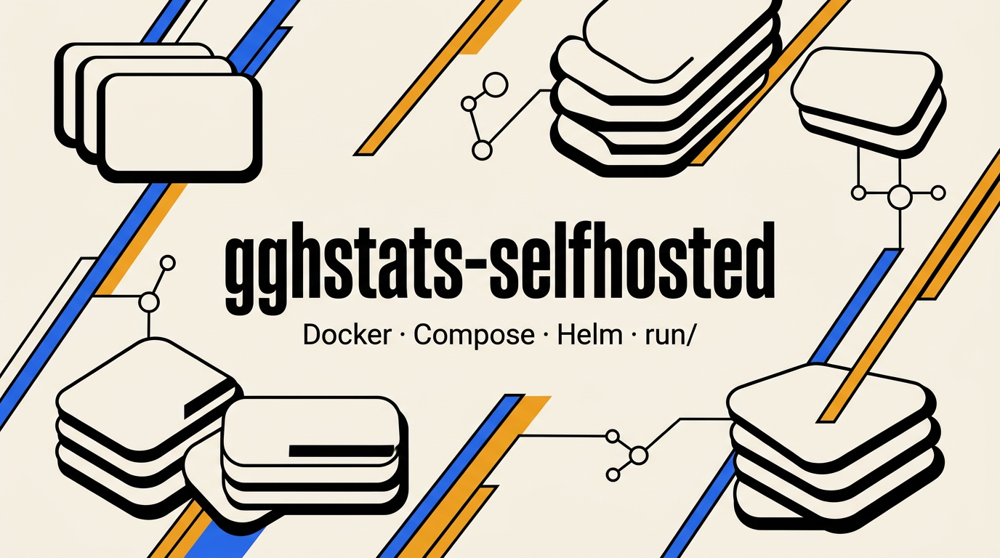

# gghstats-selfhosted

[](https://github.com/hrodrig/gghstats-selfhosted/releases)
[](https://github.com/hrodrig/gghstats-selfhosted/releases)
[](https://opensource.org/licenses/MIT)
[](https://github.com/hrodrig/gghstats/pkgs/container/gghstats)
[](https://github.com/hrodrig/gghstats)



Deployment manifests for **[gghstats](https://github.com/hrodrig/gghstats)** — Compose, Helm, `docker run`, optional observability. **App source and releases:** [github.com/hrodrig/gghstats](https://github.com/hrodrig/gghstats).

**Demo:** [gghstats.hermesrodriguez.com](https://gghstats.hermesrodriguez.com) · Observability example: [gghstats-obs.hermesrodriguez.com](https://gghstats-obs.hermesrodriguez.com)

**Policies:** [Community and policies](#community-and-policies), [community standards](#community-standards) — changelog, contributing, security, code of conduct, agent guidelines.

---

## Table of contents

- [Pick a path](#pick-a-path)
- [Standalone binary](#standalone-binary)
- [Docker single container](#docker-single-container)
- [Docker Compose minimal](#docker-compose-minimal)
- [Docker Compose Traefik HTTPS](#docker-compose-traefik-https)
- [Observability optional](#observability-optional)
- [Kubernetes Helm](#kubernetes-helm)
- [Persistent data and secrets](#persistent-data-and-secrets)
- [Repository layout](#repository-layout)
- [Versioning](#versioning)
- [Community and policies](#community-and-policies)
- [Community standards](#community-standards)
- [License](#license)

---

## Pick a path

| You want… | Section |
|-----------|---------|
| **Binary only** (no Docker) | [Standalone binary](#standalone-binary) |
| **Single container** (`docker run`) | [Docker single container](#docker-single-container) |
| **Compose, one service** (quick VPS) | [Docker Compose minimal](#docker-compose-minimal) |
| **HTTPS + domain** (Traefik + Let’s Encrypt) | [Docker Compose Traefik HTTPS](#docker-compose-traefik-https) |
| **Prometheus / Grafana / Loki** (after Traefik) | [Observability optional](#observability-optional) |
| **Kubernetes** | [Kubernetes Helm](#kubernetes-helm) |

Shared env template for Compose: copy **[`run/common/.env.example`](run/common/.env.example)** to **`${GGHSTATS_HOST_DATA}/.env`**, set **`GGHSTATS_HOST_DATA`** inside that file, and pass **`--env-file "${GGHSTATS_HOST_DATA}/.env"`** to Compose. Deeper walkthroughs: **[`run/README.md`](run/README.md)**.

**[↑ Contents](#table-of-contents)**

---

## Standalone binary

**Goal:** run the app without Docker.

1. Download a release asset for your OS/arch from **[gghstats Releases](https://github.com/hrodrig/gghstats/releases)**.
2. Extract the binary, then:

```bash
export GGHSTATS_GITHUB_TOKEN=ghp_xxx   # classic PAT with repo scope as needed
./gghstats serve
```

**Check:** open **http://localhost:8080** (or the port you set).

**Stop:** `Ctrl+C`. SQLite path depends on your config — see **[gghstats `.env.example`](https://github.com/hrodrig/gghstats/blob/main/.env.example)**.

**More:** [run/standalone/linux](run/standalone/linux/README.md) · [macos](run/standalone/macos/README.md) · [windows](run/standalone/windows/README.md)

**[↑ Contents](#table-of-contents)**

---

## Docker single container

**Goal:** one container, no Compose file.

```bash
export GGHSTATS_HOST_DATA=/home/gghstats/gghstats-data
mkdir -p "$GGHSTATS_HOST_DATA"

docker run -d \
  -e GGHSTATS_GITHUB_TOKEN=ghp_xxx \
  -e GGHSTATS_FILTER="your-github-user/*" \
  -p 8080:8080 \
  -v "${GGHSTATS_HOST_DATA}:/data" \
  --name gghstats \
  ghcr.io/hrodrig/gghstats:v0.1.3
```

Use an image tag that exists on GHCR ([releases](https://github.com/hrodrig/gghstats/releases)); match **`GGHSTATS_VERSION`** in [`run/common/.env.example`](run/common/.env.example).

**Check:** `curl -sS -o /dev/null -w '%{http_code}\n' http://127.0.0.1:8080/` (expect `200` or `3xx`).

**Remove:**

```bash
docker stop gghstats && docker rm gghstats
```

**More:** [run/docker/README.md](run/docker/README.md)

**[↑ Contents](#table-of-contents)**

---

## Docker Compose minimal

**Goal:** quick stack from this repo (single service, GHCR image).

```bash
git clone https://github.com/hrodrig/gghstats-selfhosted.git
cd gghstats-selfhosted
export GGHSTATS_HOST_DATA=/home/gghstats/gghstats-data
mkdir -p "$GGHSTATS_HOST_DATA"
cp run/common/.env.example "${GGHSTATS_HOST_DATA}/.env"
# Edit "${GGHSTATS_HOST_DATA}/.env": GGHSTATS_GITHUB_TOKEN, GGHSTATS_VERSION, and GGHSTATS_HOST_DATA (same path as above)

docker compose --env-file "${GGHSTATS_HOST_DATA}/.env" -f run/docker-compose/minimal/docker-compose.yml up -d
```

**Check:** `curl -sS -o /dev/null -w '%{http_code}\n' http://127.0.0.1:8080/` (or your `GGHSTATS_PORT`).

**Remove:**

```bash
docker compose --env-file "${GGHSTATS_HOST_DATA}/.env" -f run/docker-compose/minimal/docker-compose.yml down
```

**More:** [run/docker-compose/minimal/README.md](run/docker-compose/minimal/README.md)

**[↑ Contents](#table-of-contents)**

---

## Docker Compose Traefik HTTPS

**Goal:** production-style TLS on your domain (ports **80** / **443**).

**Prerequisites:** DNS **A/AAAA** for `GGHSTATS_HOSTNAME` → this host; **80** and **443** reachable.

```bash
git clone https://github.com/hrodrig/gghstats-selfhosted.git
cd gghstats-selfhosted
export GGHSTATS_HOST_DATA=/home/gghstats/gghstats-data
mkdir -p "$GGHSTATS_HOST_DATA"
cp run/common/.env.example "${GGHSTATS_HOST_DATA}/.env"
# Edit "${GGHSTATS_HOST_DATA}/.env": GGHSTATS_GITHUB_TOKEN, GGHSTATS_HOSTNAME, ACME_EMAIL, GGS_UID, GGS_GID,
# GGHSTATS_VERSION, and GGHSTATS_HOST_DATA (same absolute path as above — SQLite lives next to this file)

docker compose --env-file "${GGHSTATS_HOST_DATA}/.env" -f run/docker-compose/traefik/docker-compose.yml up -d
```

**Check:** `curl -sS -o /dev/null -w '%{http_code}\n' https://your-hostname/` after DNS and TLS succeed.

**Remove:**

```bash
docker compose --env-file "${GGHSTATS_HOST_DATA}/.env" -f run/docker-compose/traefik/docker-compose.yml down
```

**More:** [run/docker-compose/traefik/README.md](run/docker-compose/traefik/README.md)

**[↑ Contents](#table-of-contents)**

---

## Observability optional

**Goal:** Prometheus, Grafana, Loki, etc. **Requires** the Traefik stack above so network **`gghstats_edge`** exists. Use the **same** **`GGHSTATS_HOST_DATA`** as your main **`${GGHSTATS_HOST_DATA}/.env`** (SQLite and secrets in one host directory).

```bash
export GGHSTATS_HOST_DATA=/home/gghstats/gghstats-data
mkdir -p "$GGHSTATS_HOST_DATA"
cp run/docker-compose/observability/observability.env.example "${GGHSTATS_HOST_DATA}/.env.observability"
# Edit "${GGHSTATS_HOST_DATA}/.env.observability" — set GRAFANA_ADMIN_PASSWORD at minimum (must match GGHSTATS_HOST_DATA used for Traefik / main .env)
```

**Expose Grafana on HTTPS via Traefik (public hostname)** — use this if you want Grafana on the internet with the **same** Traefik / Let’s Encrypt as gghstats (recommended once DNS is ready):

1. In **`"${GGHSTATS_HOST_DATA}/.env.observability"`**, set a dedicated FQDN and matching root URL (must match what users open in the browser):

   ```bash
   GRAFANA_HOSTNAME=gghstats-obs.example.com
   GRAFANA_ROOT_URL=https://gghstats-obs.example.com
   ```

2. **DNS:** point **`GRAFANA_HOSTNAME`** to this host (A/AAAA or CNAME), same idea as **`GGHSTATS_HOSTNAME`** for the main app.

3. Start the stack with **both** Compose files (the second file adds Traefik **labels** only; it does not add another Traefik container). Use **both** `-f` lines on every `up` / `pull` / `down` that recreates Grafana, or HTTPS routing breaks until you fix it.

```bash
docker compose --env-file "${GGHSTATS_HOST_DATA}/.env.observability" -p gghstats-obs \
  -f run/docker-compose/observability/docker-compose.observability.yml \
  -f run/docker-compose/observability/docker-compose.observability.traefik.yml \
  up -d
```

**Local / LAN only (no Traefik route for Grafana)** — Grafana on **`http://localhost:${GRAFANA_PORT:-3000}`**; omit **`docker-compose.observability.traefik.yml`**:

```bash
docker compose --env-file "${GGHSTATS_HOST_DATA}/.env.observability" -p gghstats-obs \
  -f run/docker-compose/observability/docker-compose.observability.yml up -d
```

**Check / troubleshoot / SSH tunnel:** **[run/docker-compose/observability/README.md](run/docker-compose/observability/README.md)** (curl checks, `down -v`).

**Remove (containers + stack volumes):** use the **same** `-f` list you used for `up`. Examples:

```bash
# If you started with Traefik overlay (two files), remove with two files:
docker compose --env-file "${GGHSTATS_HOST_DATA}/.env.observability" -p gghstats-obs \
  -f run/docker-compose/observability/docker-compose.observability.yml \
  -f run/docker-compose/observability/docker-compose.observability.traefik.yml \
  down -v

# If you started with only the base file:
docker compose --env-file "${GGHSTATS_HOST_DATA}/.env.observability" -p gghstats-obs \
  -f run/docker-compose/observability/docker-compose.observability.yml down -v
```

**[↑ Contents](#table-of-contents)**

---

## Kubernetes Helm

**Recommended:** install from the **Helm repository** on **GitHub Pages** ([**`index.yaml`**](https://hrodrig.github.io/gghstats-selfhosted/index.yaml); chart packages are attached to [GitHub Releases](https://github.com/hrodrig/gghstats-selfhosted/releases) as **`gghstats-<version>.tgz`**).

**GitHub Pages:** The [Pages URL](https://hrodrig.github.io/gghstats-selfhosted/) serves **`index.yaml`** for Helm and includes a short **HTML landing** for humans. **`helm repo add`** only needs the HTTPS base URL — you do not have to open the site in a browser.

**Naming (this repo vs the chart):** This GitHub repository is **`gghstats-selfhosted`** (deployment manifests only). The Helm chart lives under **`run/kubernetes/helm/gghstats/`** — the final directory name **`gghstats`** is the **chart name** (see `name:` in **`Chart.yaml`**), the same name as the **application** the chart deploys. It is **not** the repository name. Published chart packages and chart-releaser GitHub Releases use the pattern **`gghstats-<chart-version>`** (e.g. **`gghstats-0.1.6.tgz`**); **Git tags** for this repo use **`v<semver>`** (e.g. **`v0.1.6`**) per **`VERSION`**.

```bash
helm repo add gghstats https://hrodrig.github.io/gghstats-selfhosted
helm repo update
helm install gghstats gghstats/gghstats -n gghstats --create-namespace -f my-values.yaml
```

**GitHub token (recommended):** do **not** put the PAT in **`my-values.yaml`**. Create a secret that matches the chart defaults (**`secretName`:** `gghstats-secret`, **`secretKey`:** `github-token` — see **`githubToken`** in [`values.yaml`](run/kubernetes/helm/gghstats/values.yaml)). Replace **`YOUR_GITHUB_TOKEN`** with your [classic or fine-grained PAT](https://github.com/hrodrig/gghstats/blob/main/README.md) (repo scope as needed):

```bash
kubectl create namespace gghstats
kubectl create secret generic gghstats-secret \
  -n gghstats \
  --from-literal=github-token=YOUR_GITHUB_TOKEN
```

Then run **`helm install`** (omit **`--create-namespace`** if the namespace already exists). Keep **`githubToken.value:`** empty in **`my-values.yaml`** so Helm does not embed the token in a release manifest.

Use **`helm show values gghstats/gghstats`** (after `helm repo update`) or the copy in the repo browser to build **`my-values.yaml`** (image tag, persistence, resources, etc.). Pick any namespace with **`-n`** (here **`gghstats`**); if you use another name, use the same namespace in **`kubectl`** and **`helm`** and adjust **`my-values.yaml`** if you reference the secret explicitly.

If **`helm repo add`** fails (network, Pages outage, or first minutes after a new release), try again later or install **from this repository** below.

**From this repository (sources, templates, contributing):** the chart under **`run/kubernetes/helm/gghstats/`** is the same chart; clone it to inspect YAML, open issues, or install without the published repo:

```bash
git clone https://github.com/hrodrig/gghstats-selfhosted.git
cd gghstats-selfhosted
helm install gghstats ./run/kubernetes/helm/gghstats -n gghstats --create-namespace -f my-values.yaml
```

See **[`values.yaml`](run/kubernetes/helm/gghstats/values.yaml)** in-tree for defaults.

**Check:** `kubectl get pods -n gghstats -l app.kubernetes.io/name=gghstats` and your Ingress/Service URL.

**Remove:**

```bash
helm uninstall gghstats -n gghstats
```

**More:** [run/kubernetes/helm/gghstats/README.md](run/kubernetes/helm/gghstats/README.md) · [run/kubernetes/manifests](run/kubernetes/manifests/README.md)

**[↑ Contents](#table-of-contents)**

---

## Persistent data and secrets

*Recommended on servers:* colocate SQLite and env files outside the clone (see below).

Keep **SQLite**, **`${GGHSTATS_HOST_DATA}/.env`**, and **`${GGHSTATS_HOST_DATA}/.env.observability`** in one host directory (e.g. `/home/gghstats/gghstats-data/`). Set **`GGHSTATS_HOST_DATA`** inside the main **`.env`** to that absolute path. Run Compose from the clone root with **`--env-file "${GGHSTATS_HOST_DATA}/.env"`** for the app stacks and **`--env-file "${GGHSTATS_HOST_DATA}/.env.observability"`** for observability (`-p gghstats-obs`). See [`run/common/.env.example`](run/common/.env.example) and [`run/docker-compose/observability/observability.env.example`](run/docker-compose/observability/observability.env.example).

**[↑ Contents](#table-of-contents)**

---

## Repository layout

```text
run/
├── common/.env.example          # Shared vars for Compose + image tag
├── standalone/{linux,macos,windows}/
├── docker/                      # docker run
├── docker-compose/
│   ├── minimal/
│   ├── traefik/
│   └── observability/
└── kubernetes/
    ├── helm/gghstats/           # Helm chart named "gghstats" (app); not the repo name
    └── manifests/
```

**[↑ Contents](#table-of-contents)**

---

## Versioning

- **[`VERSION`](VERSION)** — semver of **this repository** (Compose, docs, `run/`, etc.). When you change it, align the **Version** badge in this README and (if you keep a release entry) **CHANGELOG.md**; on **`main`**, tag with **`v<semver>`** (e.g. `v0.2.0`). This number is **not** tied to the Helm chart on every bump.
- **Helm chart (`run/kubernetes/helm/gghstats/Chart.yaml` → `version:`)** — semver of the **chart package** published to [GitHub Pages](https://hrodrig.github.io/gghstats-selfhosted/index.yaml) / [Releases](https://github.com/hrodrig/gghstats-selfhosted/releases). Bump **`version:`** when the chart itself changes (templates, `values`, etc.). It may **lag** behind **`VERSION`** (e.g. repo `0.2.0`, chart `0.1.5` until you edit the chart). [chart-releaser](https://github.com/helm/chart-releaser) may skip publishing if **`run/kubernetes/helm/`** did not change — expected for docs-only repo releases.
- **`Chart.yaml` → `appVersion`** — **gghstats** application / image line; align with [gghstats releases](https://github.com/hrodrig/gghstats/releases) when you bump the deployed image story.
- **`GGHSTATS_VERSION`** in **`${GGHSTATS_HOST_DATA}/.env`** (or the env file you pass to Compose) — **container image** tag on GHCR ([gghstats releases](https://github.com/hrodrig/gghstats/releases)), not the same as **`VERSION`**.

**[↑ Contents](#table-of-contents)**

---

## Community and policies

| Document | Purpose |
|----------|---------|
| **[CHANGELOG.md](CHANGELOG.md)** | Release history and notable changes to **this** repository (manifests, docs, layout). |
| **[CONTRIBUTING.md](CONTRIBUTING.md)** | How to open issues/PRs, branch policy (`develop` → `main`), and checks before submitting. |
| **[CODE_OF_CONDUCT.md](CODE_OF_CONDUCT.md)** | Community standards (Contributor Covenant). |
| **[SECURITY.md](SECURITY.md)** | How to report security vulnerabilities responsibly. |
| **[AGENTS.md](AGENTS.md)** | Guidelines for AI coding agents (Cursor, etc.) working in this repo. |

**Application** issues (bugs, features in the Go app or UI) belong in **[gghstats](https://github.com/hrodrig/gghstats)** — not here.

**[↑ Contents](#table-of-contents)**

---

## Community standards

- License: [`LICENSE`](LICENSE)
- Contributing: [`CONTRIBUTING.md`](CONTRIBUTING.md)
- Code of conduct: [`CODE_OF_CONDUCT.md`](CODE_OF_CONDUCT.md)
- Security policy: [`SECURITY.md`](SECURITY.md)
- Changelog: [`CHANGELOG.md`](CHANGELOG.md)
- Agent guidelines: [`AGENTS.md`](AGENTS.md)

Thanks for self-hosting **[gghstats](https://github.com/hrodrig/gghstats)** with these manifests. We would love to hear how **easy or difficult** it was to run **gghstats** self-hosted (Compose, Helm, `docker run`, observability, or anything in [`run/`](run/)). Share feedback in **[GitHub Issues](https://github.com/hrodrig/gghstats-selfhosted/issues)** or, if enabled for this repository, **Discussions**.

**[↑ Contents](#table-of-contents)**

---

## License

MIT — see [LICENSE](LICENSE).

**[↑ Contents](#table-of-contents)**
